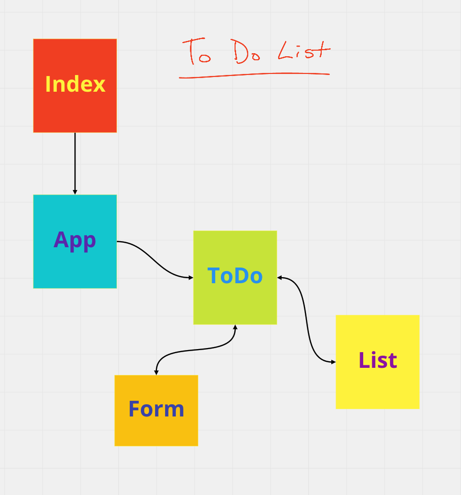

# React To Do App

## Links

>Deployed Site
[https://react-todo-danengel.netlify.app/](https://react-todo-danengel.netlify.app/)

>ReadMe
[https://github.com/daneng1/todo/blob/main/README.md](https://github.com/daneng1/todo/blob/main/README.md)

>Heroku DB
[https://danengel-api-server.herokuapp.com/todo](https://danengel-api-server.herokuapp.com/todo)

## User Stories

>Phase 1

- As a user, I would like an easy way to add a new to do item using an online interface
- As a user, I would like my to do items to have an assignee, due date, difficulty meter, status and the task itself
- As a user, I would like to delete to do items that are no longer needed
- As a user, I would like to easily mark to do items as completed
- As a user, I would like to edit an existing to do item.

>Phase 2

- As a user, I would like to be able to add, update, and delete To Do items
- As a user, I would like my To Do Items to be permanently stored so that I can re-access them at any time, using any device

>Phase 3

- As a user, I would like to see my To Do List Items a few at a time so that I don’t have to wade through them all
- As a user, I would like my default view to only be “Incomplete” Items so that I can quickly determine what I have to do.
- As a user, I would like my list sorted by difficulty so that I can more easily prioritize
- As a user, I would like the option to change my default preferences with regards to how many Items I see per page, which items are filtered, and how they are sorted

## Technical Requirements

>Phase 1

- Convert the architecture from Class Based Components into Functional Components
- Apply styling and layout using React Bootstrap Components
- Ensure the current functionality works unchanged
- Manage state using the useState() hook
- Use a useEffect() hook to change the title of the browser with the complete/incomplete counts
- Use a useEffect() hook to pre-load the seeded To Do Items
- Match the provided mockup for the design
  - Use react-bootstrap components and theming
  - Some interactivity notes:
    - Each item in list should show the text of the item as well as the assignee
    - When clicked, toggle the “complete” status of the item.
    - Items should be styled differently when complete/incomplete making their status visually obvious.

>Phase 2

- On application start, display all of the to do items from the API/Database
- When adding an item, issue a POST request to the API server
- When marking items complete, issue a PUT request to the API server for the item
- When deleting items, issue a DELETE request to the API server for the item

>Phase3

- Show a maximum of a certain number of items per screen
- Hide or show completed items in the list
- Sort the items based on any of the keys (i.e. difficulty)
- Implement this using context
  - Create a context for managing application settings and provide this at the application level
  - Display or Hide completed items (boolean)
  - Number of items to display per screen (number)
  - Default sort field (string)
  - You may manually set (hard code) those state settings in the context provider during development

## UML

